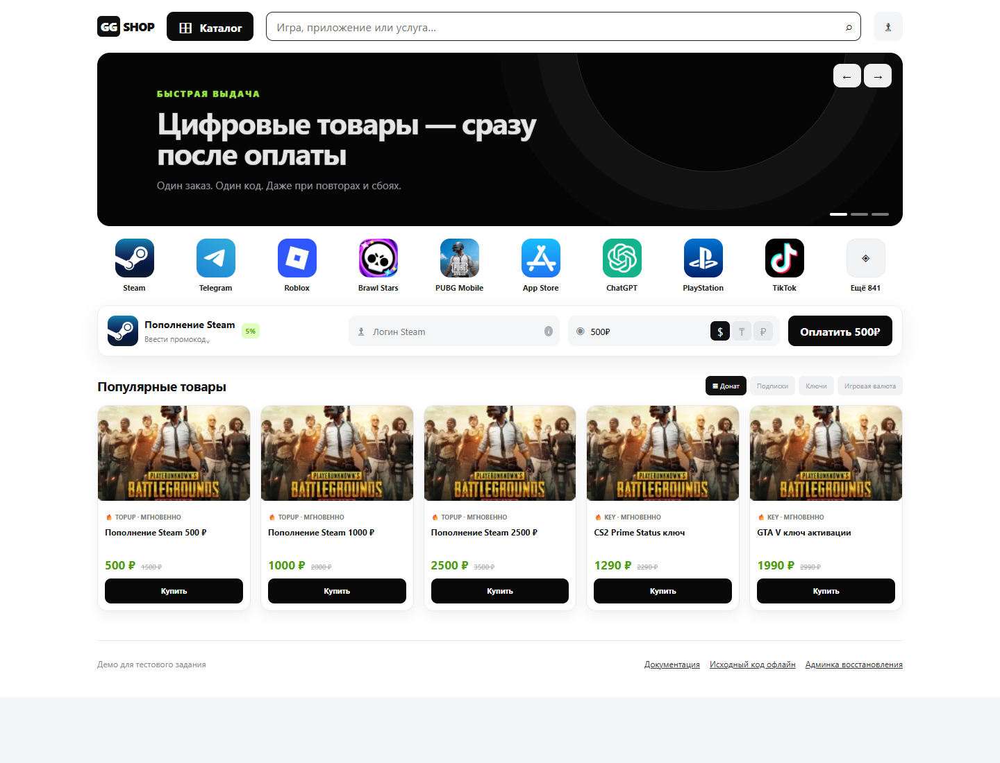

# fullstack-test-shop

Тестовый магазин цифровых товаров с главным акцентом на **однократную выдачу под гонками** и безопасное восстановление после сбоев.

- Витрина: Angular 21 LTS, близко к предоставленному Figma-макету.
- API: NestJS + Swagger.
- Данные и очередь: PostgreSQL 17, Prisma и raw SQL для блокировок.
- Выдача: отдельный worker и две HTTP-заглушки поставщиков.
- Production URL: [test-shop.komaroff-dev.ru](https://test-shop.komaroff-dev.ru)
- API docs: [test-shop.komaroff-dev.ru/api/docs](https://test-shop.komaroff-dev.ru/api/docs)
- Учебник на production: [test-shop.komaroff-dev.ru/docs/](https://test-shop.komaroff-dev.ru/docs/)
- README на production: [test-shop.komaroff-dev.ru/docs/README.md](https://test-shop.komaroff-dev.ru/docs/README.md)
- Offline release: [v1.1.1 с чистым ZIP](https://github.com/komaroffsergei/fullstack-test-shop/releases/tag/v1.1.1)
- CI: format, typed lint, strict typecheck (workspace + root), unit, 13-scenario race, E2E, OpenAPI, offline-doc verification, Docker runtime smoke и gitleaks.

## Витрина



Экран работающего [демо магазина](https://test-shop.komaroff-dev.ru), снят 4 сентября 2026 года.
На нём показаны каталог сервисов, форма пополнения Steam и карточки товаров.

## Быстрый запуск

Нужны Node.js 22, pnpm 11 и Docker.

```bash
cp .env.example .env
docker compose up -d postgres
pnpm install
pnpm db:generate
pnpm db:deploy
pnpm db:seed
pnpm dev
```

Откройте `http://localhost:4200`. API слушает `http://localhost:4000`, поставщики — `4101/4102`. Значение `ADMIN_TOKEN` из локального `.env` вводится на `/admin`; frontend его не сохраняет.

## Как пройти основной сценарий

1. На витрине нажать «Купить» или «Оплатить 500 ₽».
2. На странице заказа нажать «Оплатить успешно».
3. Заглушка оплаты отправит настоящий webhook в inbox.
4. Worker применит событие, запросит поставщика и покажет выданный код.

Для воспроизводимого сбоя в `/admin` выберите `out-of-stock`, `5xx before issue` или `timeout after issue`. После пополнения пула ручной retry использует те же provider request IDs.

## Как требования ТЗ превращены в тесты

Ниже приведены дословные требования из исходного файла `Тестовое задание Фуллстек разработчик.docx`. После каждой цитаты указано, какой тест запускается, что именно он обязан доказать и какой результат уже получен. Это важно: зелёный HTTP-ответ сам по себе не доказывает однократную выдачу.

### Ключевой этап: двойной клик и параллельные webhook

> «Гарантировать, что при двойном клике "Купить", повторной отправке вебхука и двух одновременных вебхуках по одному заказу ключ выдается ровно один раз без задвоения и потери. Приложите способ воспроизвести скрипт/тест с параллельными запросами» — этап 2, стр. 1–3 ТЗ.

Проверка разделена на два уровня:

- `tests/e2e/storefront.spec.ts` делает настоящий `dblclick` по кнопке «Купить»;
- `tests/race/run.ts` отправляет 50 одинаковых и 50 разных событий в живой Nest API, после чего напрямую считает строки PostgreSQL и физически использованные ключи.

Ожидается: один заказ на один `Idempotency-Key`, одна `delivery_jobs`, одна `fulfillments`, один закреплённый provider key и один публичный код. Зафиксировано: **PASS** локально и на production.

### Пять главных критериев приёмки

> «1) 50 параллельных вебхуков "оплачено" по одному заказу, в системе ровно один факт выдачи, израсходован ровно один ключ»
>
> «2) Повторный вебхук с тем же event_id ничего не меняет»
>
> «3) Вебхук пришел раньше создания заказа или не по порядку, обработано корректно, без потери и дубля»
>
> «4) Пустой пул ключей, заказ в восстановимом состоянии, без падения, после пополнения повторная выдача дает ровно один ключ»
>
> «5) Промокод с лимитом N под параллельными запросами, применен не более N раз (этап 4)» — раздел «Критерии приемки», стр. 3 ТЗ.

| Критерий ТЗ         | Какой тест запускается                     | Что ожидается                                                                                                        | Фактический результат                                      |
| ------------------- | ------------------------------------------ | -------------------------------------------------------------------------------------------------------------------- | ---------------------------------------------------------- |
| 50 webhook          | race-сценарии 3 и 4; production-сценарий 3 | для одинакового `event_id`: 1 event; для 50 уникальных: 50 events; в обоих случаях 1 job, 1 fulfillment, 1 spent key | PASS: локально 2910 + 2255 мс; production 2028 мс          |
| Replay `event_id`   | race-сценарий 3                            | ещё 10 replay не меняют status, code и history                                                                       | PASS: strict no-op подтверждён сравнением снимков до/после |
| Early/unordered     | race-сценарий 5; production-сценарий 4     | раннее событие сначала `pending`, затем применяется; поздний `failed` не откатывает `delivered`                      | PASS: локально 1186 мс; production 1713 мс                 |
| Empty pool/recovery | race-сценарий 8; production-сценарий 5     | `out_of_stock` без падения; после top-up два concurrent retry дают один код                                          | PASS: локально 3680 мс; production 990 мс                  |
| Promo limit N       | race-сценарий 12; production-сценарий 9    | `LIMIT3` под 50 запросами: ровно 3 успешных применения, 47 конфликтов, `used_count=3`                                | PASS: локально 531 мс; production 671 мс                   |

### Гарантии доставки webhook

> «Вебхук может прийти несколько раз (at-least-once) обработка должна быть идемпотентной»; «Вебхуки могут прийти не по порядку»; «Ответ должен быть быстрым 200 OK принято; 5xx платежка повторит доставку» — контракт webhook, стр. 5 ТЗ.

Тест создаёт событие до заказа, повторяет один `event_id`, отправляет разные `paid/failed`, проверяет быстрый `200`, состояние inbox и отсутствие лишней delivery job. Ожидание: событие сначала атомарно сохранено, и только затем endpoint отвечает. Результат: **PASS** в race-сценариях 3–7 и production-сценариях 2–4.

### Ловушка timeout поставщика

> «На повтор с тем же request_id поставщик обязан вернуть тот же самый код, а не выдать новый»; «таймаут ≠ отказ. Поставщик мог успеть выдать код, но ответ не дошел» — контракт поставщика, стр. 5 ТЗ.

Race-сценарий 9 включает режим `timeout_after_issue`: Provider A сначала резервирует ключ, затем теряет ответ. Worker обязан повторить запрос к A с тем же `request_id` и не обращаться к B. Ожидание: попытки `timeout + success`, один request A, ноль requests B, один spent key. Результат: **PASS**, локально 1723 мс и production 1815 мс.

### Восстановимые статусы

> «out_of_stock — оплачено, но кода нет в наличии (восстановимый, не падение)»; «delivery_failed — оба поставщика не смогли выдать (восстановимый)»; «Из out_of_stock и delivery_failed возможно безопасное восстановление без задвоения» — жизненный цикл заказа, стр. 6 ТЗ.

Race-сценарии 8 и 11 отдельно создают пустые пулы и два ответа 5xx. После top-up/retry проверяются прежние provider request IDs, единственный fulfillment и финальный `delivered`. Результат: **PASS** для обеих ветвей восстановления.

### Серверная цена и промокод

> «Итоговую скидку считает сервер, данным от клиента не доверять» — этап 4, стр. 3 ТЗ.

Race-сценарии 2, 6 и 12 отправляют клиентские money-поля, неправильные amount/currency и 50 конкурентных заказов с `LIMIT3`. Ожидание: неизвестные money-поля получают `400`, несовпадающая оплата становится `invalid`, цена берётся из server snapshot, лимит не превышается. Результат: **PASS**.

### Пять обязательных UI-интерактивов

> «Интерактив обязателен в 5 местах»: карусель; открытие/закрытие «Каталога»; активное состояние валют; плавное выделение иконок сервисов; выделение карточек товара — стр. 3 ТЗ.

Первый Playwright-тест проверяет все пять интерактивов через реальные clicks/hover и вычисленные CSS-стили, затем выполняет покупку. Второй ждёт сетевую готовность всех 15 изображений. Третий открывает каталог при `390×844` и сравнивает `scrollWidth ≤ clientWidth`. Ожидание: 3/3 теста, один код, один переход `delivered`, ноль browser errors. Результат: **3/3 PASS** локально и на публичном HTTPS.

## Как вручную запустить всю проверку

### 1. Подготовка локального окружения

Нужны Node.js `22.22.2`, pnpm `11.7.0` и Docker. Команды выполняются из корня репозитория. Race suite делает demo reset, поэтому его нельзя направлять на неизвестную или ценную БД.

PowerShell:

```powershell
Copy-Item .env.example .env
docker compose up -d postgres
pnpm install --frozen-lockfile
pnpm db:generate
pnpm db:deploy
pnpm db:seed
pnpm verify
pnpm dev
```

`pnpm dev` остаётся работать и запускает пять процессов: API `:4000`, worker, Provider A `:4101`, Provider B `:4102` и Angular `:4200`.

### 2. Проверка готовности

Во втором терминале:

```powershell
curl.exe -fsS http://127.0.0.1:4000/api/health/live
curl.exe -fsS http://127.0.0.1:4000/api/health/ready
curl.exe -fsS http://127.0.0.1:4000/docs/README.md
curl.exe -fsS http://127.0.0.1:4200/
```

Ожидается: оба health endpoint возвращают `{"status":"ok"}`, README начинается с `# fullstack-test-shop`, а Angular отвечает HTML с HTTP `200`.

### 3. Гонки, OpenAPI и браузер

```powershell
pnpm test:race
pnpm openapi:generate

$env:PLAYWRIGHT_EXTERNAL_SERVER = '1'
$env:WEB_URL = 'http://127.0.0.1:4200'
pnpm test:e2e
Remove-Item Env:PLAYWRIGHT_EXTERNAL_SERVER
Remove-Item Env:WEB_URL
```

Ожидаемый финальный вывод:

```text
Acceptance complete: 13/13 scenarios passed.
OpenAPI contract verified from http://127.0.0.1:4000/api/openapi.json
3 passed
```

Если стек заранее не запущен, можно выполнить только `pnpm test:e2e`: Playwright сам запустит `pnpm dev`, дождётся `http://127.0.0.1:4200` и остановит дочерний процесс после тестов.

## Что запускает каждая команда

Важно: `pnpm verify` покрывает статические проверки, unit/component, документацию и сборку, но **не** заменяет race, OpenAPI, E2E и Docker smoke.

| Команда                                            | Инструкция: что запускается                                                            | Ожидание                                                                           | Зафиксированный результат |
| -------------------------------------------------- | -------------------------------------------------------------------------------------- | ---------------------------------------------------------------------------------- | ------------------------- |
| `pnpm format:check`                                | Prettier для всех tracked текстовых файлов                                             | exit `0`, `All matched files use Prettier code style!`                             | PASS                      |
| `pnpm lint`                                        | ESLint с `--max-warnings=0`                                                            | 0 errors и 0 warnings                                                              | PASS                      |
| `pnpm typecheck`                                   | TypeScript strict для 7 workspace и root tests/scripts                                 | все `tsc --noEmit` завершаются с exit `0`                                          | PASS                      |
| `pnpm comments:verify`                             | TypeScript AST проверяет русский комментарий перед каждой функцией/методом             | `Russian comments verified for 156/156 methods and functions.`                     | PASS, 156/156             |
| `pnpm test`                                        | 8 domain Vitest + 1 Angular TestBed                                                    | 9/9 tests                                                                          | PASS, 9/9                 |
| `pnpm docs:offline`                                | заново собирает автономный HTML со всеми разрешёнными исходниками                      | создаётся `docs/offline/index.html`                                                | PASS, 105 файлов          |
| `pnpm docs:verify`                                 | сверяет manifest, SHA-256, line anchors, обязательные категории и отсутствие секретов  | `Offline handbook verified: 105 exact source files.`                               | PASS, 105/105             |
| `pnpm build`                                       | собирает domain/database/client, Nest API/worker/provider и Angular production bundles | все workspace `Done`, exit `0`                                                     | PASS                      |
| `pnpm test:race`                                   | 13 HTTP + PostgreSQL сценариев на живом стеке                                          | `Acceptance complete: 13/13 scenarios passed.`                                     | PASS, 13/13               |
| `pnpm openapi:generate`                            | читает живой `/api/openapi.json` и требует все 14 операций                             | `OpenAPI contract verified...`                                                     | PASS, 14 paths            |
| `pnpm test:e2e`                                    | 3 Playwright Chromium сценария                                                         | `3 passed`, без console/page errors                                                | PASS, 3/3                 |
| `docker build -t fullstack-test-shop:submission .` | production multi-stage image                                                           | image собирается; внутри есть Angular, Prisma, tsx, OpenSSL и runtime dependencies | PASS                      |
| GitHub Actions `secret-scan`                       | gitleaks по полной Git-истории                                                         | ни одного опубликованного секрета                                                  | PASS                      |

## Все 13 локальных race-сценариев: ожидание и результат

Одна команда запускает всю таблицу:

```bash
pnpm test:race
```

|   № | Что запускается                               | Что тест обязан получить                                                               | Результат чистого прогона |
| --: | --------------------------------------------- | -------------------------------------------------------------------------------------- | ------------------------- |
|   1 | contracts, seed, health, metrics, admin guard | 12 товаров, 14 OpenAPI операций, health `ok`, metrics доступны, admin без токена `401` | PASS, 4360 мс             |
|   2 | double click/idempotency/server-owned money   | ответы `201 + 200`, одна order row; другой payload `409`; клиентская цена `400`        | PASS, 2296 мс             |
|   3 | 50 одинаковых webhook + 10 replay             | одна event row/job/fulfillment/key; status/code/history неизменны после replay         | PASS, 2910 мс             |
|   4 | 50 разных `paid`                              | 50 event rows, но одна job/fulfillment/key                                             | PASS, 2255 мс             |
|   5 | early и unordered events                      | early `pending → applied`; `failed → paid → failed` не регрессирует `delivered`        | PASS, 1186 мс             |
|   6 | amount/currency mismatch                      | оба события `invalid`, order остаётся `created`, job отсутствует                       | PASS, 421 мс              |
|   7 | payment simulator                             | simulator действительно выполняет HTTP webhook, заказ становится `delivered`           | PASS, 314 мс              |
|   8 | физически пустые пулы и recovery              | `out_of_stock`; после top-up два retry дают один code                                  | PASS, 3680 мс             |
|   9 | timeout after issue                           | тот же request A, attempts `timeout + success`, B не вызван, один key                  | PASS, 1723 мс             |
|  10 | A отвечает out-of-stock                       | безопасный fallback; fulfillment принадлежит Provider B                                | PASS, 455 мс              |
|  11 | оба provider отвечают 5xx                     | `delivery_failed`; recovery переиспользует request IDs и выдаёт один code              | PASS, 718 мс              |
|  12 | quote, ONCEONLY replay, LIMIT3 × 50           | quote не тратит лимит; ONCEONLY считается один раз; LIMIT3 даёт 3 успеха/47 конфликтов | PASS, 531 мс              |
|  13 | deterministic reset и processing guard        | возвращаются 50 ключей/нулевые promo counters; при processing job reset получает `503` | PASS, 2304 мс             |

## Все 3 браузерных теста

| Playwright-тест                                   | Ожидание                                                                                         | Локальный результат | Production-результат |
| ------------------------------------------------- | ------------------------------------------------------------------------------------------------ | ------------------- | -------------------- |
| `five required interactions and purchase flow`    | 5 UI-интерактивов, `dblclick`, UUID order, paid simulator, один code, один `delivered`, 0 ошибок | PASS, 7,8 с         | PASS                 |
| `all visible storefront images load successfully` | минимум 15 изображений, каждое `complete=true` и `naturalWidth>0` за 10 с                        | PASS, 638 мс        | PASS                 |
| `narrow viewport does not overflow horizontally`  | viewport `390×844`, каталог открыт, `scrollWidth ≤ clientWidth`, 0 ошибок                        | PASS, 633 мс        | PASS                 |

Production Playwright: **3/3 PASS за 17,0 с**.

## Ручной production black-box

Production suite изменяет только demo-данные и требует приватный `X-Admin-Token`. Запускайте его только с разрешением на reset. Токен не должен попадать в README, shell history, screenshot или логи.

PowerShell:

```powershell
$env:PRODUCTION_BASE_URL = 'https://test-shop.komaroff-dev.ru'
$env:PRODUCTION_ADMIN_TOKEN = '<токен, переданный отдельно>'
$env:ALLOW_DEMO_RESET = '1'
pnpm test:production
```

Ожидаемый итог:

```text
Production acceptance complete: 9/9 scenarios passed.
```

|   № | Production-сценарий через Nginx/TLS                     | Ожидание                                                                                         | Зафиксированный результат                |
| --: | ------------------------------------------------------- | ------------------------------------------------------------------------------------------------ | ---------------------------------------- |
|   1 | HTTPS surface/docs/health/catalog/OpenAPI/metrics/admin | root и весь `/docs` комплект `200`, live/ready `ok`, 12 товаров, 14 paths, anonymous admin `401` | PASS, автоматический gate каждого deploy |
|   2 | idempotent double click/conflict/money tamper           | один заказ; replay тот же; conflict/money tamper отклонены                                       | PASS, 192 мс                             |
|   3 | 50 identical + 50 unique paid webhook                   | однократная выдача в обеих группах                                                               | PASS, 2028 мс                            |
|   4 | early/unordered payment events                          | нет потери, дубля или регрессии                                                                  | PASS, 1713 мс                            |
|   5 | out-of-stock + concurrent recovery                      | восстановимый статус и один код после двух retry                                                 | PASS, 990 мс                             |
|   6 | timeout-after-issue                                     | безопасный replay того же request A                                                              | PASS, 1815 мс                            |
|   7 | Provider A out-of-stock                                 | однозначный fallback на B                                                                        | PASS, 317 мс                             |
|   8 | два ответа provider 5xx                                 | `delivery_failed`, затем безопасное восстановление                                               | PASS, 729 мс                             |
|   9 | LIMIT3 × 50                                             | не более трёх применений                                                                         | PASS, 671 мс                             |

Для отдельной браузерной проверки production:

```powershell
$env:PLAYWRIGHT_EXTERNAL_SERVER = '1'
$env:WEB_URL = 'https://test-shop.komaroff-dev.ru'
pnpm test:e2e
```

После браузерной покупки нужно снова восстановить demo seed:

```powershell
$env:PRODUCTION_FINAL_RESET_ONLY = '1'
pnpm test:production
```

Ожидается: `Production demo reset verified: recovery=0, ready=ok.`

## Подтверждённая приёмка

Проверенный runtime commit [`7e9daeb15095`](https://github.com/komaroffsergei/fullstack-test-shop/commit/7e9daeb150950d51f52493606c60c7dcdc4baac2) прошёл:

- [CI `33503939960`](https://github.com/komaroffsergei/fullstack-test-shop/actions/runs/33503939960) — `success`;
- [production deploy `33504299670`](https://github.com/komaroffsergei/fullstack-test-shop/actions/runs/33504299670) — `success`, immutable GHCR-образ;
- 13/13 локальных PostgreSQL race-сценариев;
- 9/9 black-box сценариев через настоящий `https://test-shop.komaroff-dev.ru`;
- 3/3 локальных и 3/3 production Playwright-тестов;
- 156/156 методов и функций с ведущими русскими комментариями;
- 105/105 исходных файлов в автономном HTML;
- tutorial, offline handbook, README и CODEMAP доступны на production `/docs` и проверены по точному содержимому;
- финальный demo reset: `recovery=0`, `ready=ok`.

Точные assertions, найденные дефекты и исправления: [docs/ACCEPTANCE_REPORT.md](docs/ACCEPTANCE_REPORT.md). Более глубокое объяснение каждого теста: [docs/TESTING.md](docs/TESTING.md). Полная связь `пункт ТЗ → код → тест → ручная проверка`: [docs/REQUIREMENTS_MATRIX.md](docs/REQUIREMENTS_MATRIX.md).

## Почему код выдаётся ровно один раз

`event_id`, `orders.idempotency_key`, `delivery_jobs.order_id`, `fulfillments.order_id` и `fulfillments.code` защищены UNIQUE-ограничениями. Worker атомарно захватывает одно задание через `FOR UPDATE SKIP LOCKED`, а поставщик атомарно закрепляет свободный ключ за стабильным `request_id`. При timeout worker повторяет **тот же запрос тому же поставщику**: если код уже был зарезервирован, поставщик возвращает его повторно. Внешний HTTP никогда не выполняется внутри транзакции.

## Навигация по проекту

- [Интерактивный HTML-учебник](docs/tutorial/index.html) — подробный курс по стеку и всем критическим потокам, переключатель «профессионально / как для 10 лет», контрольные вопросы и code map с прямыми ссылками на GitHub.
- [Автономный HTML source handbook](docs/offline/index.html) — 100+ точных текстовых исходников внутри одного HTML: поиск по именам/коду, номера строк, deep links, копирование/скачивание, две версии объяснения и SHA-256 каждого файла. Интернет не нужен.
- [Публичная копия документации](https://test-shop.komaroff-dev.ru/docs/) — тот же tutorial, offline handbook, README и CODEMAP из immutable production-образа.
- [CODEMAP.md](CODEMAP.md) — entrypoints, модули, таблицы и карта тестов.
- [docs/REQUIREMENTS_MATRIX.md](docs/REQUIREMENTS_MATRIX.md) — полное соответствие ТЗ.
- [docs/ACCEPTANCE_REPORT.md](docs/ACCEPTANCE_REPORT.md) — фактические локальные/CI/production результаты.
- [docs/SUBMISSION_CHECKLIST.md](docs/SUBMISSION_CHECKLIST.md) — финальный preflight и создание чистого архива.
- [docs/FIDELITY_LEDGER.md](docs/FIDELITY_LEDGER.md) — сверка браузера с макетом.
- [docs/ARCHITECTURE.md](docs/ARCHITECTURE.md) — схемы контейнеров, последовательностей и состояний.
- [docs/API.md](docs/API.md), [docs/TESTING.md](docs/TESTING.md), [docs/DEPLOYMENT.md](docs/DEPLOYMENT.md), [docs/SECURITY.md](docs/SECURITY.md).
- [docs/TIMELOG.md](docs/TIMELOG.md) — фактический замер времени.

## Production

Приложение работает с одного origin за Nginx и Let's Encrypt. На VDS запущены `app`, `worker`, `provider-a`, `provider-b` и PostgreSQL; наружу опубликован только `app` на loopback-интерфейсе. NestJS раздаёт Angular, `/docs/tutorial/`, `/docs/offline/`, `/docs/README.md` и `/docs/CODEMAP.md` из одного immutable образа. Релизный workflow разворачивает GHCR-образ по git SHA, выполняет миграции и health-check. Production-секреты хранятся только на сервере и в GitHub Actions secrets.

## Осознанные границы

Нет реального эквайринга и подписи webhook, пользовательской авторизации, отзывов, полного футера, dark mode и отдельного mobile-макета — они прямо исключены или не требуются в ТЗ. Узкий экран при этом не ломается. Redis/RabbitMQ не используются: для этого объёма PostgreSQL inbox + очередь проще, наблюдаемее и дают необходимые гарантии.

Лицензия: MIT.
