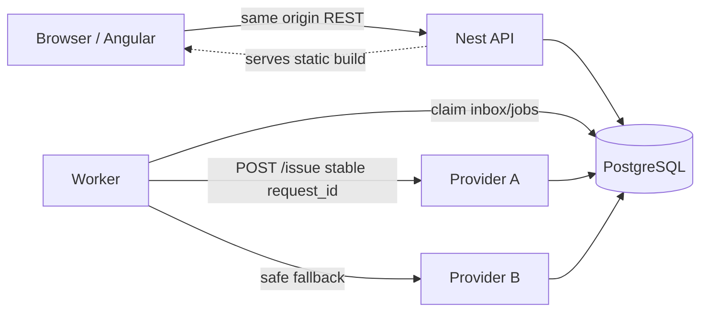
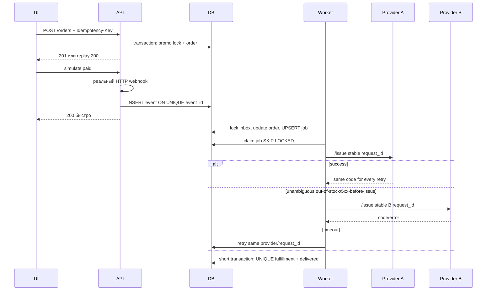
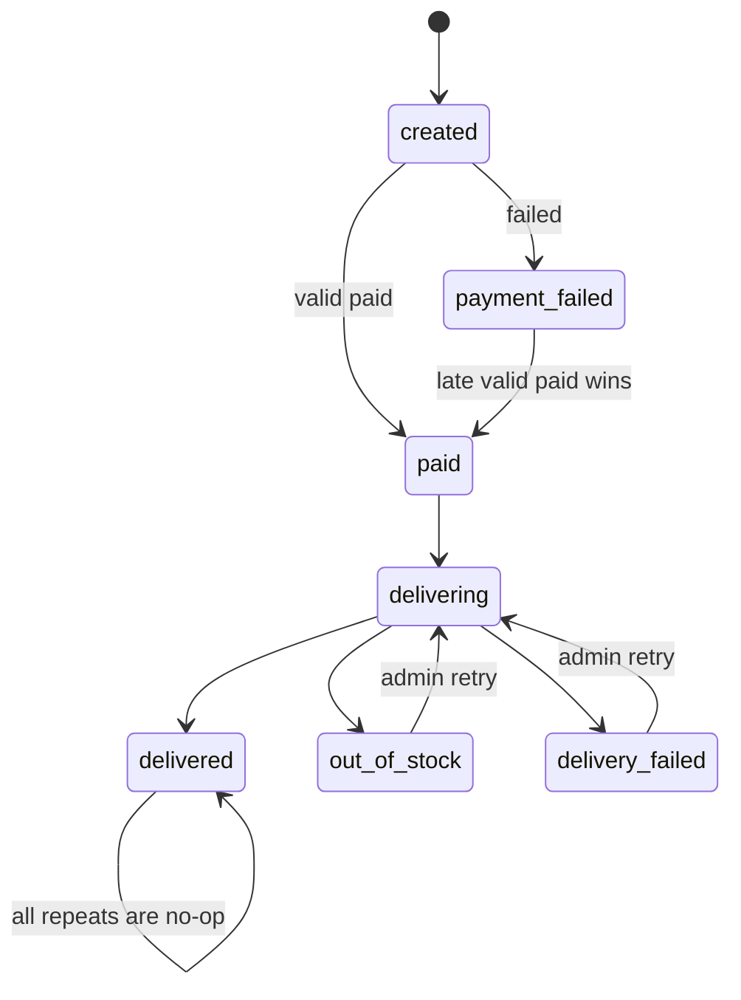

# Архитектура

## Контейнеры

PostgreSQL — единственная координирующая система. Это убирает distributed transaction между БД и отдельным брокером и достаточно для объёма тестового проекта.

## Оплата и выдача

## State machine

`delivered` никогда не регрессирует. Валидный `paid` имеет приоритет над ранее пришедшим `failed`; сумма и валюта сверяются с серверным снимком заказа.

## Блокировки

- Транзакции короткие; HTTP поставщика выполняется после commit claim.
- Inbox и job используют одинаковый порядок: сначала event/job, затем order.
- Promo row блокируется до проверки `used_count` и создания redemption.
- FK-поля и частые фильтры индексированы; есть partial indexes для pending inbox и runnable jobs.

## Ответственность процессов

| Процесс      | Читает                                       | Пишет                                                            | Не должен делать                                                            |
| ------------ | -------------------------------------------- | ---------------------------------------------------------------- | --------------------------------------------------------------------------- |
| Angular      | public REST read models                      | только HTTP commands                                             | доверять browser price, знать provider code pool, ходить в БД               |
| API          | catalog/order/promo/admin settings           | order intent, payment inbox, promo redemption, recovery commands | синхронно выдавать code внутри webhook, держать provider HTTP в transaction |
| Worker       | pending events/jobs/orders/provider requests | state/history/job/attempt/fulfillment                            | принимать пользовательский HTTP, генерировать новый request ID на retry     |
| Provider A/B | собственные settings и key rows              | atomic request→code reservation                                  | видеть admin token, менять order/fulfillment                                |
| PostgreSQL   | все durable состояния                        | constraints/locks/transactions                                   | зависеть от памяти одного Node process                                      |
| Nginx        | public HTTPS                                 | proxy only                                                       | публиковать PostgreSQL/providers наружу                                     |

Такое разделение даёт проверяемого владельца каждой записи. Например, provider физически тратит key, а worker фиксирует бизнес-fulfillment; поэтому обе стороны имеют собственную идемпотентность.

## Модель данных и инварианты

| Таблица                  | Назначение                                | Главный инвариант                                                 |
| ------------------------ | ----------------------------------------- | ----------------------------------------------------------------- |
| `products`               | server catalog                            | `sku UNIQUE`, цена неотрицательна                                 |
| `orders`                 | immutable money snapshot + current status | public ID и idempotency key уникальны; `final=base-discount`      |
| `payment_events`         | durable at-least-once inbox               | `event_id UNIQUE`; ранний order UUID допустим без FK              |
| `delivery_jobs`          | lease queue                               | `order_id UNIQUE`                                                 |
| `provider_requests`      | stable operation identity                 | одна строка на `(order, provider)`                                |
| `provider_call_attempts` | append-only network outcome journal       | каждая HTTP попытка наблюдаема                                    |
| `provider_keys`          | физический stock поставщика               | code и request ID уникальны; issuedAt/requestId появляются вместе |
| `fulfillments`           | финальный товар заказа                    | `order_id UNIQUE`, `code UNIQUE`                                  |
| `order_status_history`   | audit transitions                         | не заменяет current state, а объясняет его                        |
| `promocodes`             | правило и bounded counter                 | `0 ≤ used_count ≤ max_uses`                                       |
| `promo_redemptions`      | факт скидки конкретного заказа            | `order_id UNIQUE`                                                 |

## Транзакционные границы

### Создание заказа

Одна интерактивная transaction:

1. прочитать active product;
2. при promo заблокировать его row `FOR UPDATE`;
3. проверить limit/currency;
4. вычислить целые копейки;
5. создать order + initial history;
6. создать redemption и увеличить counter;
7. commit.

HTTP или другие внешние вызовы внутри отсутствуют. UNIQUE conflict обрабатывается после rollback чтением победившего order.

### Применение payment event

Одна короткая worker transaction:

1. `payment_events` row через `FOR UPDATE SKIP LOCKED`;
2. lock соответствующего order;
3. validate snapshot;
4. monotonic status transition;
5. upsert одной delivery job;
6. пометить event processed/invalid;
7. commit.

### Выдача

Разделена на три части:

1. atomic job claim + commit;
2. provider HTTP вне transaction;
3. atomic completion/retry/recoverable write.

Если процесс падает между 1 и 3, lease возвращает job. Если падает после provider side effect, стабильный request ID возвращает тот же code.

### Reset

Payment-event и delivery-job claim берут транзакционный `pg_advisory_xact_lock_shared`, а reset — соответствующий exclusive advisory lock. Поэтому несколько worker’ов продолжают claim-ить параллельно, обычное чтение таблиц не блокируется, но reset не может пройти между проверкой и новым claim. После получения exclusive-lock reset проверяет отсутствие processing jobs. Если worker уже успел захватить job и вышел к поставщику, reset получает `503`, а не удаляет данные из-под внешнего вызова.

## Политика внешних сбоев

| Наблюдение                            | Что известно                    | Действие                    |
| ------------------------------------- | ------------------------------- | --------------------------- |
| A success с совпавшим request ID/code | выдача доказана                 | final fulfillment           |
| A explicit out-of-stock               | выдачи не было                  | попробовать B               |
| A controlled 5xx-before-issue         | выдачи не было по mock contract | попробовать B               |
| A timeout/transport error             | выдача неизвестна               | retry A с тем же request ID |
| B timeout                             | выдача неизвестна               | retry B с тем же request ID |
| оба explicit out-of-stock             | stock отсутствует               | `out_of_stock`              |
| оба однозначно не смогли              | товар не выдан                  | `delivery_failed`           |
| fulfillment уже существует            | результат окончательный         | job success no-op           |

## Масштабирование

- API stateless относительно процесса; можно запускать несколько replicas.
- Worker безопасно масштабируется горизонтально: `SKIP LOCKED` распределяет rows.
- Provider mock тоже выдерживает parallel requests за счёт row locks/UNIQUE.
- Узкое место тестового объёма — PostgreSQL connection pool; `connection_limit` и concurrency теста должны быть согласованы.
- Для большого production потребуются retention/partitioning payment events/attempts/history и, возможно, outbox+brokeр. ADR-001 объясняет, почему это не добавлено заранее.

## Модель угроз корректности

| Угроза                         | Защита                                         |
| ------------------------------ | ---------------------------------------------- |
| double click/browser retry     | stable intent + idempotency UNIQUE/fingerprint |
| одинаковый webhook             | event UNIQUE                                   |
| разные paid events             | job/fulfillment UNIQUE                         |
| ранний webhook                 | inbox без FK + deferred JOIN                   |
| поздний failed                 | monotonic state policy                         |
| подмена browser price          | server catalog snapshot + DTO allowlist        |
| concurrent promo               | promo row lock + bounded CHECK                 |
| worker crash                   | job lease                                      |
| provider timeout after issue   | stable request ID + provider replay            |
| два workers завершают одну job | order lock + fulfillment UNIQUE                |
| небезопасный reset             | advisory RW-lock + processing refusal          |

Полная связь угроз с тестами находится в [REQUIREMENTS_MATRIX.md](REQUIREMENTS_MATRIX.md), фактические результаты — в [ACCEPTANCE_REPORT.md](ACCEPTANCE_REPORT.md).
