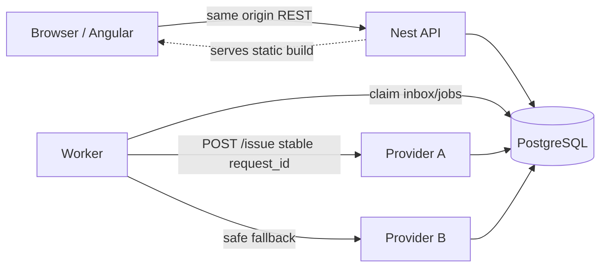
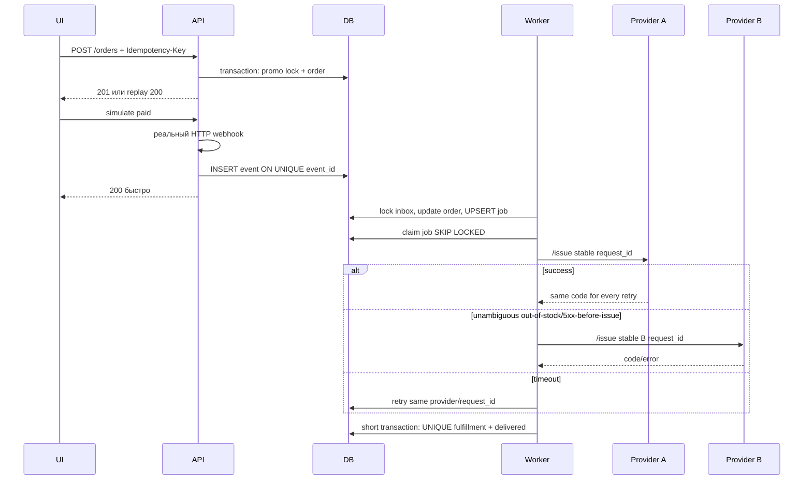
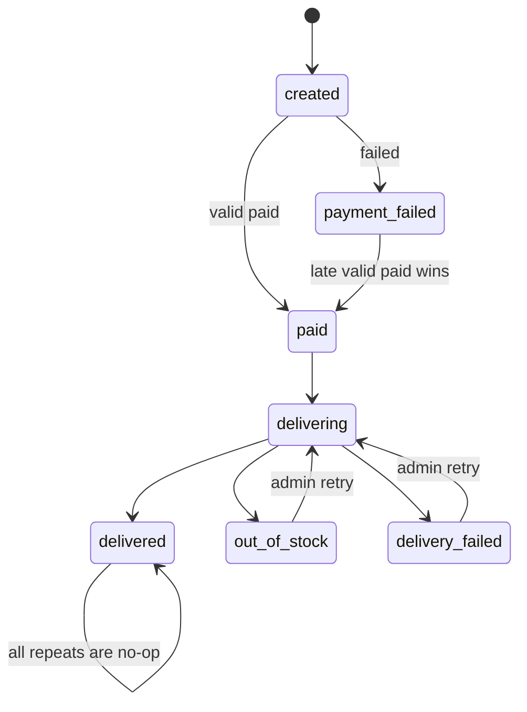

# Архитектура

## Контейнеры

PostgreSQL — единственная координирующая система. Это убирает distributed transaction между БД и отдельным брокером и достаточно для объёма тестового проекта.

## Оплата и выдача

## State machine

`delivered` никогда не регрессирует. Валидный `paid` имеет приоритет над ранее пришедшим `failed`; сумма и валюта сверяются с серверным снимком заказа.

## Блокировки

- Транзакции короткие; HTTP поставщика выполняется после commit claim.
- Inbox и job используют одинаковый порядок: сначала event/job, затем order.
- Promo row блокируется до проверки `used_count` и создания redemption.
- FK-поля и частые фильтры индексированы; есть partial indexes для pending inbox и runnable jobs.
